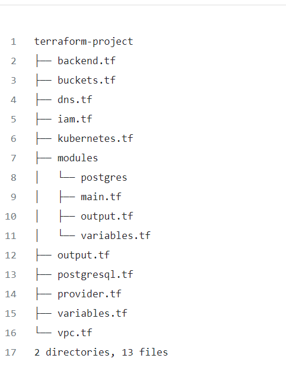
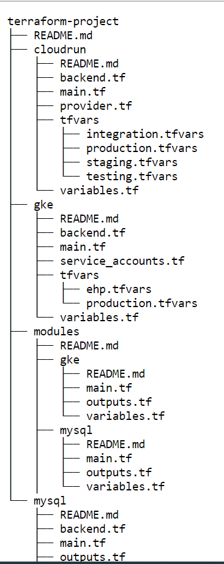

# Terraform-IaC multi-layering (Monolith Vs. Layers)

## Terraform State File
Terraform's state is the last known configuration of your infrastructure, as it was when Terraform last ran. By default, it is stored locally, but this is not a good practice. Instead, you should keep it remotely. Object storages like S3 or GCS are great for this. This way, you can run Terraform from any computer that has access to the remote state file.

Terraform uses a lock to protect its state from concurrent edits.

As the state file contains the information of every piece of infrastructure, you manage with Terraform, if the project isn't split, it will grow in size alongside your infrastructures.

Another feature that makes Terraform powerful is <b>modules</b>. With Terraform, you can wrap some reusable code into a module you can call in another section of your code.

Modules improve your code's readability and, since the v0.13, make duplicating resources easier by using logical loops. This feature is very popular, so you can find useful modules written by the community or even by the Cloud providers.

## Monolith
It's time to discuss architecture and the differences between two opposite approaches.
First, the monolithic approach consists of holding all the infrastructure configuration in <b>a single state file</b>. This is the natural evolution of an IaC repo as every change is brought to the main repo. The structure of a monolithic Terraform project might look like this:

There is a separation between files for readability, and there are modules to wrap reused code. However, behind the scenes, there is one and only remote Terraform state file.

This is fine if you are the only developer to update the project. Now we need to talk about collaboration. As your DevOps team grows, you may create more than one Pull Request at a time on the repo. This will create conflicts. One way to avoid these is to break down your monolithic configuration into layers.

## Layers
Splitting huge code into smaller pieces is what we do when developing microservices. Since Infrastructure as Code is still code, it is subject to the same constraints and concepts. A layered IaC Terraform project may look like this:

This allows collaboration. As there is one state file per layer and per workspace, each team member can make changes to different layers without conflicting with coworkers' modifications to other layers.

You can terraform apply two layers simultaneously without worrying about the state lock, which is fantastic.