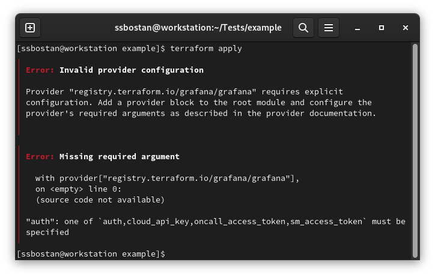

# Terraform Tutorial — Part 2 — Providers and Resources

<p align="center">
  
</p>

## What is the Provider, and what does it do?
Providers are an important part of Terraform. From one side, they get what they should do from the Terraform, and on the other side, they communicate with real infrastructures, software, etc., to do real actions. They know everything on the real-world side of the Terraform lifecycle. For example, when you write a Terraform code to create an EC2 Instance in AWS, the AWS provider knows how to connect to the AWS API, authenticate to it, which endpoint(s) should be called to create an EC2 Instance, and it knows the AWS API responses and etc. So, if you want to integrate the Terraform with a cloud environment, infrastructure, software, etc., you need its provider to able the Terraform to communicate with it. Terraform comes with a vast of providers, and they are separated into three types. Official Providers are developed, maintained and provided by the HashiCorp team officially. Verified Providers are developed, maintained and distributed by the official team of the software (For example, the Cloudflare provider is provided by the Cloudflare company). Community Providers are developed, maintained and distributed by third parties like me, you or everyone.
You can find all available providers in the [Terraform Registry](https://registry.terraform.io)

### How to Use Providers
Providers are released separately from Terraform itself, and have their own version numbers. In production we recommend constraining the acceptable provider versions in the configuration's provider requirements block, to make sure that terraform init does not install newer versions of the provider that are incompatible with the configuration.

To use resources from a given provider, you need to include some information about it in your configuration.

#### Provider Requirements
Terraform relies on plugins called "providers" to interact with remote systems. Terraform configurations must declare which providers they require, so that Terraform can install and use them.

Each Terraform module must declare which providers it requires, so that Terraform can install and use them. Provider requirements are declared in a required_providers block.

A provider requirement consists of a local name, a source location, and a version constraint:

```json
terraform {
  required_providers {
    mycloud = {
      source  = "mycorp/mycloud"
      version = "~> 1.0" ## 
    }
  }
}
```
The required_providers block must be nested inside the top-level terraform block (which can also contain other settings).

Each argument in the required_providers block enables one provider. The key determines the provider's local name (its unique identifier within this module), and the value is an object with the following elements:

* source - the global source address for the provider you intend to use, such as hashicorp/aws.

* version - a version constraint specifying which subset of available provider versions the module is compatible with.

#### Provider Configuration
Provider configurations belong in the root module of a Terraform configuration. (Child modules receive their provider configurations from the root module,  for more information, see The  and  .)

A provider configuration is created using a provider block:

```json
provider "google" {
  project = "acme-app"
  region  = "us-central1"
}
```

## What is the Resource, and what does it do?
The resource is an abstract entity which points to something in the real world. It may point to a virtual machine in a VMware infrastructure, a file in your local system, a user in a Grafana dashboard, a database in the AWS cloud, and sometimes, it points to nothing “in the case of Null Resource”. Well, how can you find and use them? Actually, it’s up to the Provider. Every Terraform provider may provide one or more resources. For example, the AWS provider comes with a multitude of resources which able you to do anything in the AWS cloud services. You can find all resources provided by the provider in its document. For example, it’s the [AWS](https://registry.terraform.io/providers/hashicorp/aws/latest/docs) document page.

## Some things about the Resource block:
The Terraform resource block requires two parameters. Resource name and Object/Instance name. The resource name comes from the provider, and the object name is used to define an instance of the used resource. The object/instance name should be unique in the current scope of the resource. I will explain “what is the scope?” in future articles when I explain Terraform modules. For now, please keep in your mind that you can’t define two or more instances of a resource with the same name. For example, in the case of working with the “aws_instance” resource, you cannot create two instances of it with the same name.
```
resource "RESOURCE_NAME" "OBJECT_NAME" {
  argument1 = value1
  argument2 = value2
  nested_block1 {
    argument1 = value1
    argument2 = value2
  }
  nested_block2 {
    argument1 = value1
    argument2 = value2
  }
```
For example, the following code creates a private key for you.

```
resource "tls_private_key" "my_private_key" {
  algorithm = "ED25519"
}
```
To deploy it, run the following commands:
```
terraform init
terraform apply
```
After running the terraform init command, you can see Terraform detects the needed providers and installs them automatically. Right? Almost not! Actually, Terraform is able to install Official providers automatically and if you want to use any unofficial providers “either verified providers or community providers” you should define them in the required_providers block in the terraform block.

Note: All official providers are stored in the hashicorp account.

Another question is how Terraform realized that it should install the tls provider? Terraform reads the first part of the resource name to detect the provider. For example, if you define a tls_private_key resource, it reads the first part of it before the first underscore(_) and treats it as the provider name. This is a global rule for all resources and providers.

Let’s try another example:
```
resource "docker_container" "nginx" {
  name  = "nginx"
  image = "nginx:latest"
}
```
To deploy it, run the following commands:

`terraform init`
What happened?

You can see the required provider is not installed automatically because it’s not an official Terraform provider and is not located in their official account. So, we have to define it to tell Terraform where should it finds the provider and installs it. To solve the above example, we need to define the docker provider source.
```
terraform {
  required_providers {
    docker = {
      source  = "kreuzwerker/docker"
      version = ">= 2.16"
    }
  }
}

resource "docker_container" "nginx" {
  name  = "nginx"
  image = "nginx:latest"
}
```
Now let’s try the init command again:
You can see the docker provider is installed successfully.
Important Note:
The real infrastructure should exist in the real world before using the provider. For example, to use the Docker provider, you have to install the Docker on your system before using that.

## Terraform provider configuration:
Most providers need a configuration before use. For example, you should config the AWS provider with the Access Key, Secret Key, Region, etc., or the Kubernetes provider with the API address, username, password or something else. In the above example, the docker, how does Terraform recognises to deploy the Docker container on your local machine, and how we can tell it to deploy to another Docker host? All of them can be configured through the provider block. You can add zero or more providers block for each provider. Some providers come with default provider configurations, and you may not need to change them, and some of them need a configuration. You can check it from the provider documentation.

Run the following code and see the error:
```
terraform {
  required_providers {
    grafana = {
      source = "grafana/grafana"
    }
  }
}

resource "grafana_user" "ssbostan" {
  login    = "ssbostan"
  email    = "ssbostan@yahoo.com"
  password = "terraform"
  is_admin = true
}
```
You can run it with:
```
terraform init
terraform apply
```
What happened?

You got an error because the Grafana provider needs a configuration, but why you didn’t get any error when you applied the Docker container, the previous code? It’s because of the default configuration. Docker provider comes with a default configuration that points to your local Docker host, but in the case of Grafana, some required parameters should be set before applying.

Well, how can I configure the provider?
You can find all available arguments to configure the provider on the provider documentation page. When you get some knowledge about the provider configuration, you can define them in the provider block of your terraform code. For example, to solve the above code:
```
terraform {
  required_providers {
    grafana = {
      source = "grafana/grafana"
    }
  }
}

provider "grafana" {
  url  = "http://localhost:3000"
  auth = "admin:admin"
}

resource "grafana_user" "ssbostan" {
  login    = "ssbostan"
  email    = "ssbostan@yahoo.com"
  password = "terraform"
  is_admin = true
}
```
As you can see, I tell the Terraform provider what is the Grafana dashboard address and the user authentication details. After applying the above code, you can see the code is successfully deployed. Please note that you should deploy Grafana before working with the above code.

Now, login to the Grafana dashboard and see the Users page. A new user “ssbostan” should be created and available in your dashboard.


To remove the user, run the following code:
`terraform destroy`
