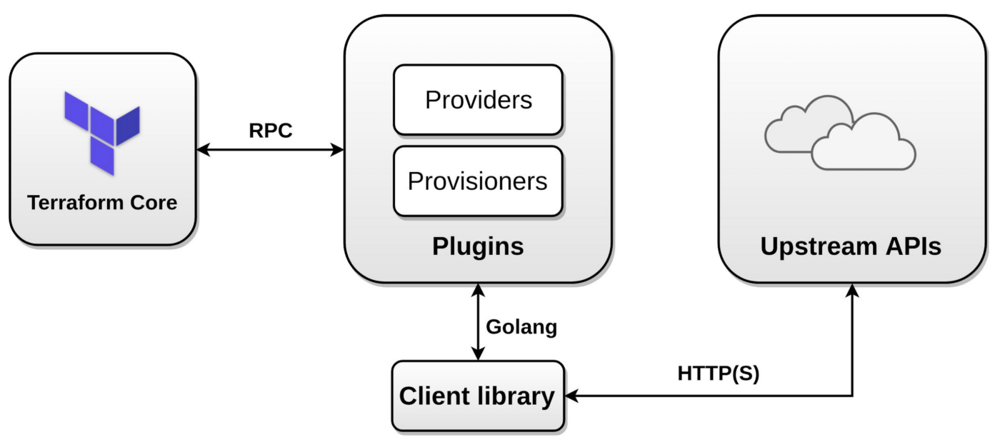

# Terraform Tutorial — Part 1 — Intro and Basic Concepts

<p align="center">
  
</p>

## What is Infrastructure as Code?
Infrastructure as Code, or for short, IaC, is a new approach to implementing infrastructures. In this model of infrastructure implementation, instead of implementing the infrastructure manually, the desired infrastructure is written in codes, and the IaC tool is responsible for implementing it on the real infrastructure. For example, you need a virtual machine on your VMware infrastructure. In a manual way, you have to open the VMware console, login to it, go to your data centre, create a new virtual machine, assign it to the proper pool, datastore, and network, and specify its resources like CPU, RAM, hard disk size, etc., but with the IaC, you can write some codes and the IaC tool create that virtual machine on your VMware infrastructure without any direct human interactions or manual action needs. The following IaC code is written in the Terraform DSL language, HCL, that creates a new virtual machine on the VMware infrastructure. It’s just an example to introduce the Infrastructure as Code. I will explain everything soon. 

``` terraform
 provider "vsphere" {
  user                 = "ssbostan"
  password             = "justfortest"
  vsphere_server       = "myvcenter.test.local"
  allow_unverified_ssl = true
}
data "vsphere_datacenter" "mydatacenter" {
  name = "mydatacenter"
}
data "vsphere_datastore" "mydatastore" {
  name          = "mydatastore"
  datacenter_id = data.vsphere_datacenter.mydatacenter.id
}
data "vsphere_resource_pool" "mypool" {
  name          = "mycluster/Resources"
  datacenter_id = data.vsphere_datacenter.mydatacenter.id
}
data "vsphere_network" "mynetwork" {
  name          = "public"
  datacenter_id = data.vsphere_datacenter.mydatacenter.id
}
resource "vsphere_virtual_machine" "myvirtualmachine" {
  name             = "myvirtualmachine"
  datastore_id     = data.vsphere_datastore.mydatastore.id
  resource_pool_id = data.vsphere_resource_pool.mypool.id
  num_cpus         = 2
  memory           = 1024
  guest_id         = "ubuntu64Guest"
  network_interface {
    network_id = data.vsphere_network.mynetwork.id
  }
  disk {
    label = "mydisk"
    size  = 20
  }
}

```
The above code logins to the VMware infrastructure, and creates a new virtual machine with the specified amount of RAM, CPU, hard disk, etc.

## Why we need Infrastructure as Code:
Infrastructure as Code, IaC, reduces human mistakes, allows us to write once and deploy many, makes the lifecycle repeatable, prevents any misconfigurations of manual deployment models, allows us to manage our infrastructures in a better way, provides a better approach to manage infrastructures at scale, and many other benefits. You checked and know many of its benefits before reading this article.

## Infrastructure as Code programming languages:
Technically, you can write your IaC codes in any programming language of your choice, for example, Python, Typescript, Golang, etc., but in the real world, it depends on the IaC tool and its supported languages. For example, with Terraform CDKTF(Cloud Development Kit for Terraform), you can write your IaC codes in Python, Typescript, Java, C#, and Go. In addition to well-known programming languages, the IaC tool may provide its DSL language. In the case of Terraform, you can write your IaC codes in HCL(HashiCorp Configuration Language) either. Some other IaC tools like Pulumi ables you to write your IaC in YAML in addition to common programming languages.

## What is Terraform?
Terraform is a well-known IaC tool in the DevOps sector, but I want to call it a Lifecycle-as-Code tool because, in addition to Infrastructure, you can manage the lifecycle of a multitude of applications like Grafana, Elasticsearch, Gitlab, Jenkins, etc. With the aid of Terraform and its providers, you can focus on writing codes and leave the deployment and management phase to the Terraform. Nowadays, the Terraform has become one of the most important parts of the DevOps lifecycle.

## Terraform Architecture:
Terraform is a plugin-based tool. So, it has a core application, terraform, and hundreds of plugins. The core application provides a unified layer to manage the IaC codes, and it’s responsible for installing required plugins, invoking them, managing state, etc. On the other hand, plugins are here to communicate with real infrastructure platforms and applications like AWS, GCP, Azure, Grafana, Jenkins, Gitlab, etc. Some of these plugins are maintained officially by the HashiCorp team, and some of them are maintained by third parties. Everyone can write and distribute his own plugin. You can find hundreds of plugins on the Terraform Registry website.
<p align="center">
  
</p>


Terraform plugins are separated into two types: Providers and Provisioners. The Provider is a plugin which is responsible for connecting to the real infrastructure or application through the API and creating, modifying, and deleting objects and resources, and the Provisioner is a plugin which is responsible for connecting to a provisioned infrastructure and making some changes to it. For example, you can use the AWS PROVIDER to provision an EC2 instance and use remote-exec PROVISIONER to execute some commands on it after provisioning. You should note that it’s not the best practice to use PROVISIONERS at all, and they are provided as a last resort solution.

## Start it NOW, Do with Terraform:
All terraform codes should be written in files with a .tf extension, usually main.tf for small and non-modular codes. Each terraform file may consist of various code blocks like resource, data, variable, output, etc. For example, in the above code, we have one resource block. All terraform blocks use the following coding convention.

<BLOCK TYPE> [<BLOCK PARAMETER1> <BLOCK PARAMETER2> ...] {
  <ARGUMENT NAME1> = <ARGUMENT VALUE1>
  <ARGUMENT NAME2> = <ARGUMENT VALUE2>
  ....
  <INNER BLOCK> {
      <ARGUMENT NAME1> = <ARGUMENT VALUE1>
      <ARGUMENT NAME2> = <ARGUMENT VALUE2>
  }
}

```
resource "local_file" "myfile" {
  filename = "myfile.txt"
  content  = "Hello from Terraform."
}
```
Each block is identified by its type and may have zero or more parameters. For example, the terraform block has no parameters, the variable block has one parameter, and the resource block has two parameters. Each block may have zero or more arguments and inner blocks. For example, on the above code intro1.tf, we have one resource block has two parameters and two arguments. The following code is an example to make your eyes familiar with various blocks.

```
variable "myfile_content" {
  type        = string
  description = "Content of myfile.txt for test"
  default     = "Hello from Terraform."
}

resource "local_file" "myfile" {
  filename = "myfile.txt"
  content  = var.myfile_content
}

output "myfile_id" {
  value = local_file.myfile.id
}
```


To install Terraform use [the official installation methods](https://www.terraform.io/downloads).

Save the above code into main.tf file and run the following commands.

terraform init

After running the init command, you can see the .terraform directory and .terraform.lock.hcl next to your main.tf file.


After initialization, run the plan command.

terraform plan

And then run the apply command.

terraform apply

After running the apply command, you can see myfile.txt as well as terraform.tfstate file next to previous files.


Let’s describe the process, files, directories, etc.

By running the terraform init command, the terraform initializes the current working directory by creating initial files, loading the remote state, downloading plugins, modules, etc. All used plugins in the current project will be downloaded to the .terraform directory and the .terraform.lock.hcl points to the version of used plugins as well as their signatures.

If you use a remote backend to store your Terraform state file, terraform.tfstate, the init command will load it during the initialization process. I will completely explain it later.

By running the terraform plan command, you can check what terraform intends to do, create/destroy, etc. With this command, you can see what will happen next. The plan command does not change anything in the real infrastructure. You can apply your changes without running the plan step. It’s just for check before making an action.

And finally, by running the terraform apply command, the Terraform will make a real action, and the resource will be created/destroyed on the remote side, real infrastructure. By running this command, you will see what will be changed, just like the plan command, and after accepting it, the deployment process is started, and after that, Terraform makes the terraform.tfstate file, which is the important file of the Terraform ecosystem. I will explain it in deep in the next articles.

The explained IaC code will create a file called myfile.txt with the specified content. The content is read from the defined variable, and after creating the file, the id of that will be shown as output.

terraform output

If we want to destroy the infrastructure or any previously deployed resources, we can use destroy command. With the destroy command, all Terraform deployed resources will be destroyed. Please note that if you destroy something, you can’t recover it with Terraform. If something is destroyed, it’s completely gone.

terraform destroy

Final words and conclusion:
Terraform is a cool tool in the DevOps sector. It has made DevOps engineers’ life sweeter and easier. With the aid of Terraform, you can manage many things with codes. It makes your infrastructure and applications lifecycle repeatable and more manageable. I have many things to teach you about the Terraform. To support this tutorial, just CLAP it, and STAR STAR STAR the following GitHub repository.

ssbostan/terraform-tutorial
You can't perform that action at this time. You signed in with another tab or window. You signed out in another tab or…
github.com

63


1
