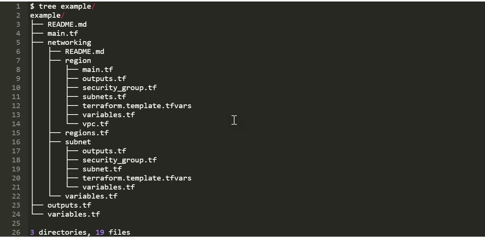

# Terraform Tutorial — Part 6 —Terraform Modules
<p align="center">
  
</p>

## Terraform Folder Structure
To create a module in your folder structure, we need to create a folder which you need to named called ‘module’ in your root of the Terraform directory. Inside the directory, we can have one or more .tf files. So, from now onwards, you can call the modules mentioned in the folder by using the module block in your configuration file. The .tf file which you are defining inside the module folder will use all the concepts of configuration files but most commonly, Input Variables, Output Variables, and Resources.
So, the folder structure can be structured as mentioned below. Here, we are going to use ‘tree’ command-line tool to see the folder structure and layout of the Terraform Project.



Within the module, you can also call other modules using the Configuration block as follows.

```
module " us-east-1" {
  source = "./network"
  cidr_block = "10.1.0.0/18"
}
```
So, when you have your own module inside the root directory, you can call the name of the folder as the module name. This means, the main.tf will have the block as mentioned above and that will get the values from the folder called network. When we call the module, It will look for the main.tf inside the module folder and executes the code mentioned in that.

Also, the above is an example of a Nested Module. Which means you can have a module inside the module. In this example, the folder Network is a module and inside that, region and subnet are other submodules of the same.  

## Terraform Registry
Just like Docker Registry or Ansible Galaxy, you can have your own Registry or space where you can publish your existing module and reuse it. Basically, Terraform Registry is available in the following ways.

* Terraform Registry – Public Registry (Hashicorps Own)
* Terraform Cloud -Private Registry
* Your Own Registry – With Terraform API.

### Terraform Registry – Public Registry
It is for the public where everyone can access this registry. Terraform gives you a fantastic option to browse, filter, find the author, and the number of downloads. This will give you a detailed dependency tree and all available Input and Output variables.

### Terraform Cloud – Private Registry
Terraform Cloud is not only for the Registry, but it will give you the platform to run and manage your Terraform Configuration file on the Cloud. Since the Terraform Privacy matters for the Enterprise, terraform offers a Private environment for every user which includes Private Registry with all the features of Terraform Public Registry.

### Your Own Registry.
If you still need your Terraform Registry to need to be on your own premises, you can have your own web server and use Terraform API to publish and reuse from your own Infrastructure. We will discuss more on how to create your own Terraform Registry in our upcoming article.

However, there is always some alternative for everything. Terraform supports modules can be used from various other sources like Your Own Computer, GitHub, S3 Buckets, BitBucket, and more.

Say,
```
# Local Path
module "example-module" {
  source = "./example-module"
}

# GitHub
module "example-module" {
  source = "github.com/hashicorp/example"
}

# BitBucket
module "example-module" {
  source = "bitbucket.org/hashicorp/terraform-example-module-aws"
}

# Your Own Git Repo
module "example-module" {
  source = "git::https://example.com/example-module.git"
}

# Your Own Mercurial Repo
module "example-module" {
  source = "hg::http://example.com/example-module.hg"
}

# S3 Bucket
module "example-module" {
  source = "s3::https://s3-eu-west-1.amazonaws.com/example-modules/example-module.zip"
}
```
https://digitalvarys.com/terraform-modules-complete-terraform-tutorial-part-5/